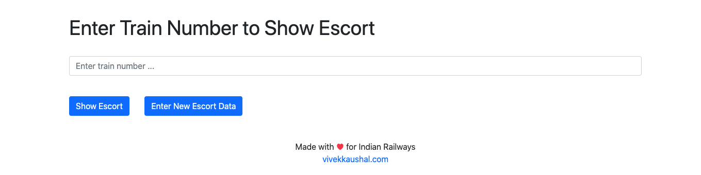
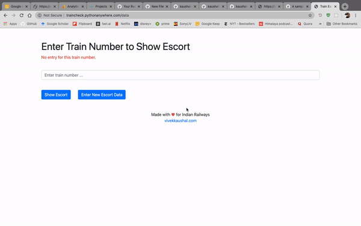

# Train Escort Management

> A web-app for Indian Railways to Manage Police Escorts in fight against COVID-19

[

---

## Table of Contents

> If your `README` has a lot of info, section headers might be nice.

- [Introduction](#introduction)
- [Features](#features)
- [Contributing](#contributing)
- [Team](#team)
- [Support](#support)
- [License](#license)

---
## Introduction

My dad works for the Indian Railways, and when special trains started running to transport migrant labourers during India’s response to the COVID-19, he discussed the logistical issue of managing police escorts on these trains and coordinating with different government agencies.
This is a simple web app created using vanilla JS HTML/CSS with a Python Flask Server and a SQLite database.

## Features

- Adding new train escort information
- Searching for escort information by entering train number
- Password protection for write function
- Viewing all escort informaiton entered over last 72 hours

---

## Contributing

### Through Fixes

- Fok this repo, or clone it to your local machine.
- Make your edits and contributions.
- Create a pull request, mention the issue number you're fixing.

### Through Issues

- Create new issues as you encounter them during testing on this repo.

---

## Team

So far, it's just me. Open to contributions from others.

---

## Support

Reach out to me at one of the following places!

- Website at <a href="http://vivekkaushal.com" target="_blank">`vivekkaushal.com`</a>
- Twitter at <a href="http://twitter.com/vi_kaushal" target="_blank">`@vi_kaushal`</a>

---

## Donations

<noscript></noscript>

---

## License

- **[MIT license](http://opensource.org/licenses/mit-license.php)**
- Copyright 2020 © <a href="http://vivekkaushal.com" target="_blank">Vivek Kaushal</a>.
